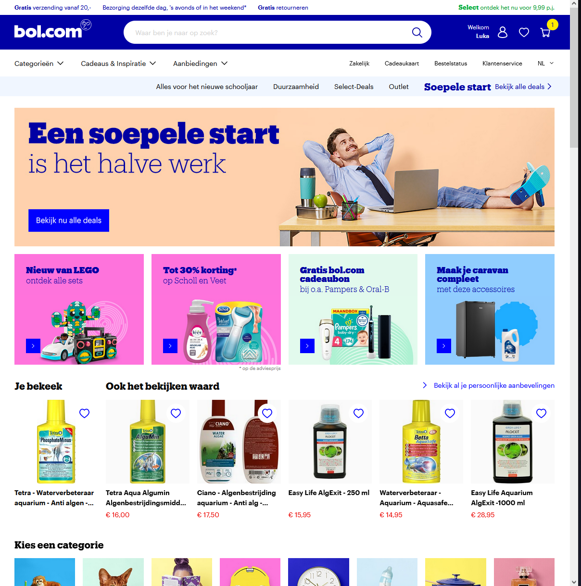
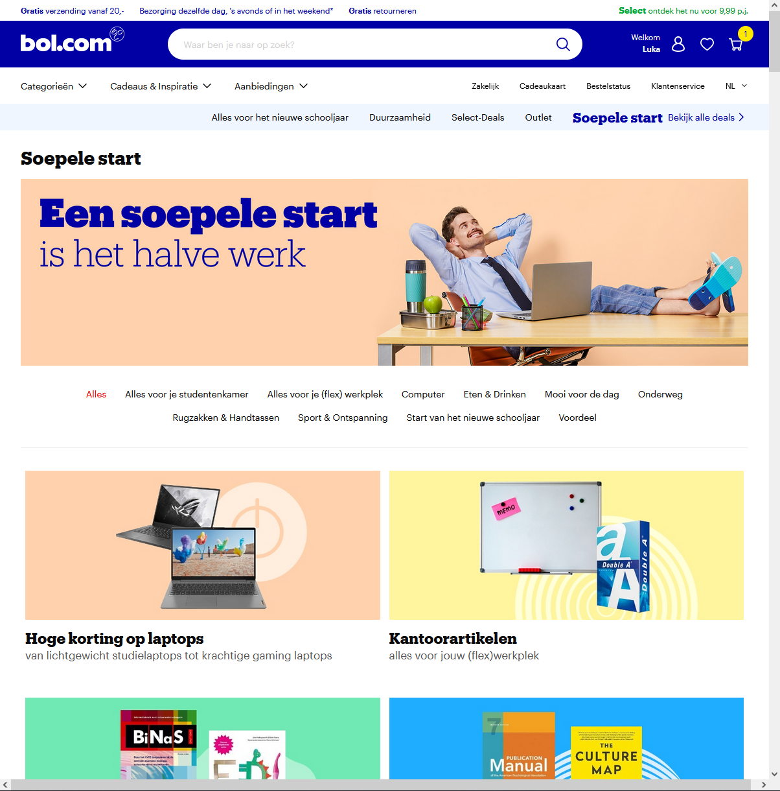
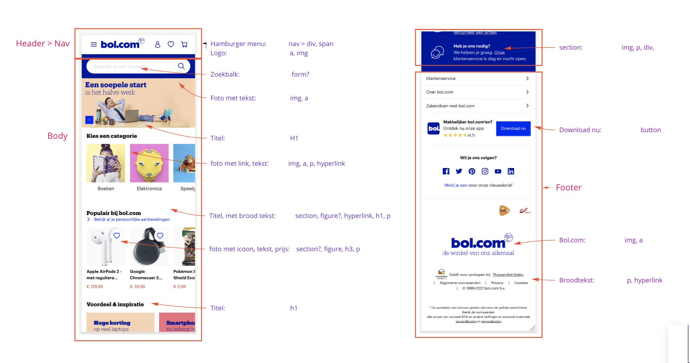
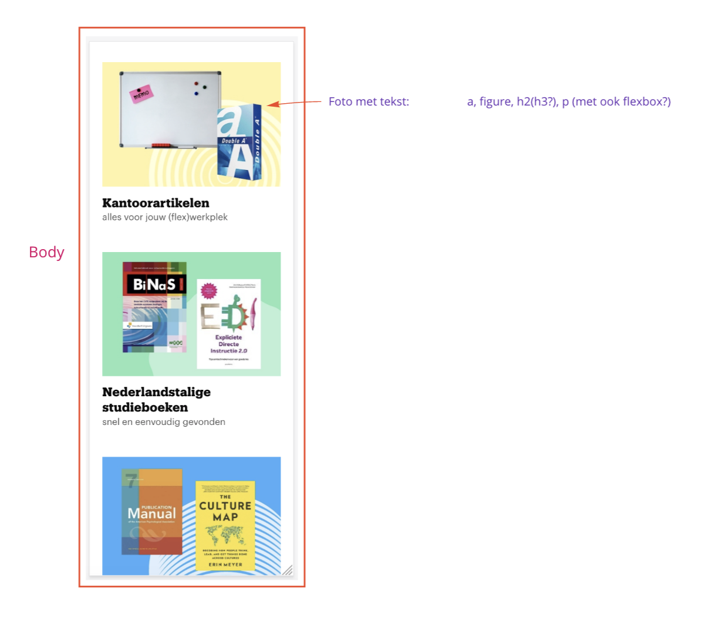

# Procesverslag
Markdown is een simpele manier om HTML te schrijven.  
Markdown cheat cheet: [Hulp bij het schrijven van Markdown](https://github.com/adam-p/markdown-here/wiki/Markdown-Cheatsheet).

Nb. De standaardstructuur en de spartaanse opmaak van de README.md zijn helemaal prima. Het gaat om de inhoud van je procesverslag. Besteedt de tijd voor pracht en praal aan je website.

Nb. Door *open* toe te voegen aan een *details* element kun je deze standaard open zetten. Fijn om dat steeds voor de relevante stuk(ken) te doen.

## Jij

uitwerken voor kick-off werkgroep

### Auteur:
Luka Bronius

#### Je startniveau:
Mijn niveau ligt tussen het blauw en rood in, wel meer naar de blauwe kant dan naar de rode ;)

#### Je focus:
Ik zal me gaan focussen op de responsive van de website.
 

## Je website

uitwerken voor kick-off werkgroep

### Je opdracht:
Voor deze opdracht zal ik proberen om de website van bol.com na te maken. Ik heb zelf nog niet super veel ervaring in het bouwen en coderen van een website, dus ik wil me graag uitdagen met deze opdracht.

#### Screenshot(s) van de eerste pagina (small screen): 
Hoofdpagina

#### Screenshot(s) van de tweede pagina (small screen):
De deals pagina

 

## Breakdownschets (week 1)

uitwerken na afloop 2e werkgroep

### de hele pagina + footer: 

 
 ### pagina 2: 

## Voortgang 1 (week 2)

uitwerken voor 1e voortgang

### Stand van zaken
In het begin van het project was ikzelf erg enthousiast en had ik er ook erg veel zin in. Echter, nu dat we twee weken verder zijn is mijn enthousiasme veranderd in frustratie. De vele elementen en termen die terugkomen bij het coderen, verwarren mij erg snel. Hierdoor ben ik soms wel urenlang bezig geweest met ‘’gemakkelijke’’ code.  

### Verslag van meeting
Nadat ik een gesprek had gehad met de docent, kreeg ik wat meer inzicht van wat ikzelf nou eigenlijk allemaal net verkeerd deed. Ik had mijn focus al te snel op het css bestand neergelegd, waardoor mijn html bestand eigenlijk een.. zooitje was. Hier kreeg ik erg bruikbare tips en feedback op.

- Ik moest mij eerst gaan focussen op het corrigeren en verbeteren van mijn HTML bestand.
- Ik moest elementen op een andere manier in het html bestand plaatsen, hiermee bedoel ik > goed nesten.
- Ik moet beter opletten op het goed sluiten van elementen. 
- ...

## Voortgang 2 (week 3)

uitwerken voor 2e voortgang

### Stand van zaken
In de 2e week had ik een enorme sprong gemaakt. Mijn HTML was al een stuk verbeterd en meerendeels van de HTML bestand had ik al met het css bestand mooier opgemaakt.

### Verslag van meeting
Tijdens het 2e voortgang gesprek kreeg ik weer hele bruikbare feedback van de docent.

- Ik gebruik te veel PX en EM's door elkaar, ik moet dit veranderen naar em's.
- Ik gebruik te vaak position: relative/absolute, terwijl ik gemakkelijk de margin kan gebruiken.
- Ik moet mijn classes op de parent plaatsen, en niet op een van de child's.
- Ik kan in mijn css bestand sommige code korter en compacter schrijven.
- Ik moet gaan beginnen met het maken van de hamburgermenu en de 2e webpagina.

## Toegankelijkheidstest (week 4)

uitwerken na test in 8e voortgang

### Bevindingen
Lijst met je bevindingen die in de test naar voren kwamen:

#### Titel eerste bevinding
Hier korte omschrijving (met indien nodig een afbeelding)

Hier een omschrijving van hoe het opgelost kan worden (met indien nodig een afbeelding)

#### Titel tweede bevinding. 
Hier korte omschrijving (met indien nodig een afbeelding)

Hier een omschrijving van hoe het opgelost kan worden (met indien nodig een afbeelding)

#### Titel volgende bevinding. 
Hier korte omschrijving (met indien nodig een afbeelding)

Hier een omschrijving van hoe het opgelost kan worden (met indien nodig een afbeelding)

#### Titel nog een bevinding. 
Hier korte omschrijving (met indien nodig een afbeelding)

Hier een omschrijving van hoe het opgelost kan worden (met indien nodig een afbeelding)

## Voortgang 3 (week 4)

uitwerken voor 3e voortgang

### Stand van zaken
hier dit ging goed & dit was lastig (neem ook screenshots op van delen van je website en code)

### Agenda voor meeting
samen met je groepje opstellen

| student 1      | student 2          | student 3    | student 4        |
| ---            | ---                | ---          | ---              |
| dit bespreken  | en dit             | en ik dit    | en dan ik dat    |
| en dat ook nog | dit als er tijd is | nog een punt | dit wil ik zeker |
| ...            | ...                | ...          | ...              |

### Verslag van meeting
hier na afloop snel de uitkomsten van de meeting vastleggen

- punt 1
- punt 2
- nog een punt
- ...

## Eindgesprek (week 5)

uitwerken voor eindgesprek

### Stand van zaken
hier dit ging goed & dit was lastig (neem ook screenshots op van delen van je website en code)

### Screenshot(s)

hier screenshot(s) van je eindresultaat

## Bronnenlijst

continu bijhouden terwijl je werkt

Nb. Wees specifiek ('css-tricks' als bron is bijv. niet specifiek genoeg).

1. bron 1
2. bron 2
3. ...

