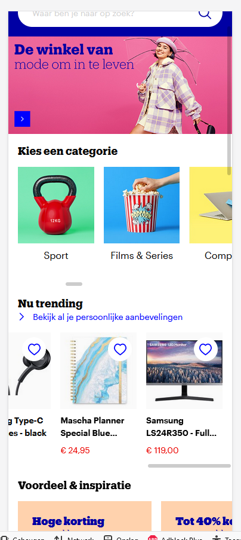
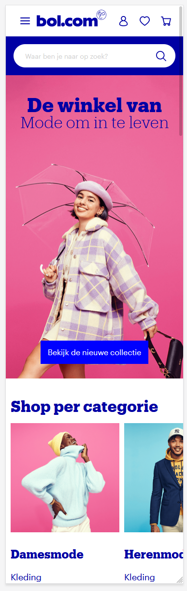
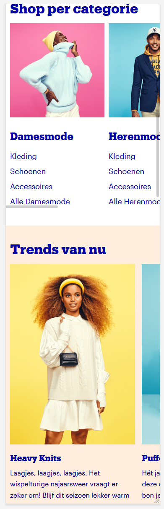
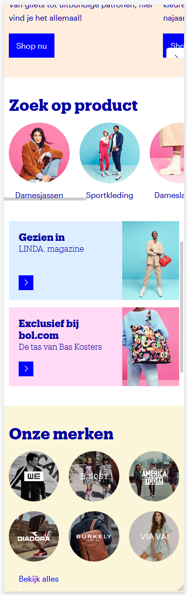
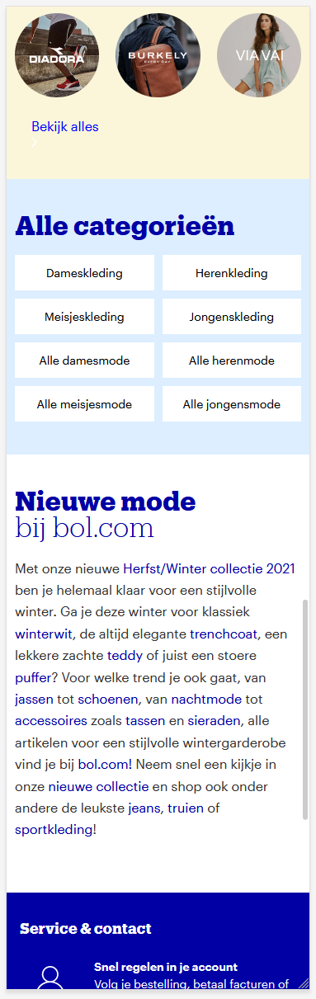
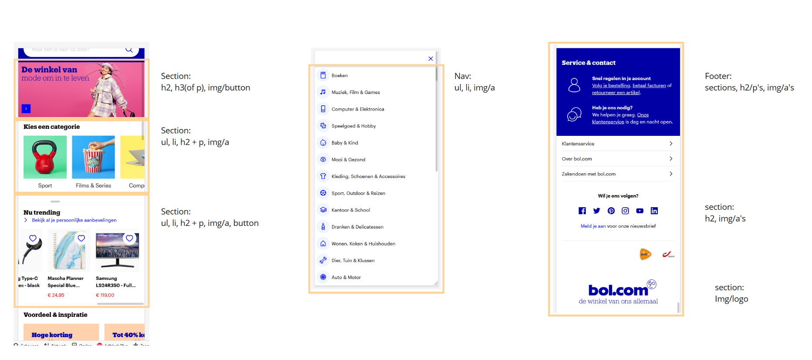
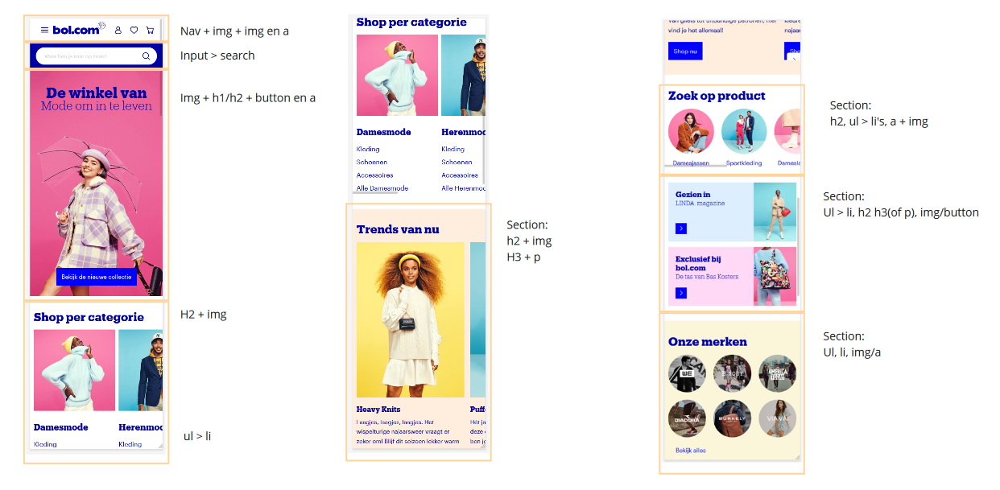
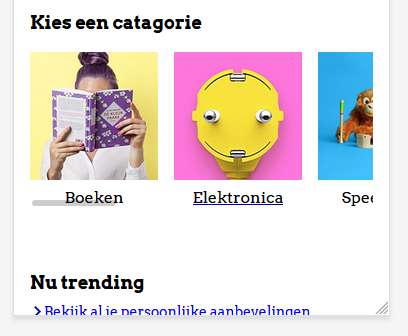
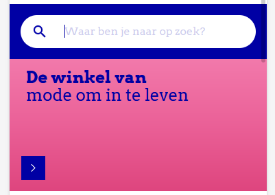

# Procesverslag
Markdown is een simpele manier om HTML te schrijven.  
Markdown cheat cheet: [Hulp bij het schrijven van Markdown](https://github.com/adam-p/markdown-here/wiki/Markdown-Cheatsheet).

Nb. De standaardstructuur en de spartaanse opmaak van de README.md zijn helemaal prima. Het gaat om de inhoud van je procesverslag. Besteedt de tijd voor pracht en praal aan je website.

Nb. Door *open* toe te voegen aan een *details* element kun je deze standaard open zetten. Fijn om dat steeds voor de relevante stuk(ken) te doen.

## Jij

uitwerken voor kick-off werkgroep

### Auteur:
Luka Bronius

#### Je startniveau:
Mijn niveau ligt tussen het blauw en rood in, wel meer naar de blauwe kant dan naar de rode ;)

#### Je focus:
Ik zal me gaan focussen op de responsiveness van de website.
 

## Je website

uitwerken voor kick-off werkgroep

### Je opdracht:
Voor deze opdracht zal ik proberen om de website van bol.com na te maken. Ik heb zelf nog niet super veel ervaring in het bouwen en coderen van een website, dus ik wil me graag uitdagen met deze opdracht.

#### Screenshot(s) van de eerste pagina (small screen): 
Hoofdpagina

#### Screenshot(s) van de tweede pagina (small screen):

 
 
  

## Breakdownschets (week 1)

uitwerken na afloop 2e werkgroep

### de 1e pagina

 
 ### pagina 2: 

## Voortgang 1 (week 2)

uitwerken voor 1e voortgang

### Stand van zaken
In het begin van het project was ikzelf erg enthousiast en had ik er ook erg veel zin in. Echter, nu dat we twee weken verder zijn is mijn enthousiasme veranderd in frustratie. De vele elementen en termen die terugkomen bij het coderen, verwarren mij erg snel. Hierdoor ben ik soms wel urenlang bezig geweest met ‘’gemakkelijke’’ code.  

### Verslag van meeting
Nadat ik een gesprek had gehad met de docent, kreeg ik wat meer inzicht van wat ikzelf nou eigenlijk allemaal net verkeerd deed. Ik had mijn focus al te snel op het css bestand neergelegd, waardoor mijn html bestand eigenlijk een.. zooitje was. Hier kreeg ik erg bruikbare tips en feedback op.

- Ik moest mij eerst gaan focussen op het corrigeren en verbeteren van mijn HTML bestand.
- Ik moest elementen op een andere manier in het html bestand plaatsen, hiermee bedoel ik > goed nesten.
- Ik moet beter opletten op het goed sluiten van elementen. 
- ...

## Voortgang 2 (week 3)

uitwerken voor 2e voortgang

### Stand van zaken
In de 2e week had ik een enorme sprong gemaakt. Mijn HTML was al een stuk verbeterd en meerendeels van de HTML bestand had ik al met het css bestand mooier opgemaakt.

### Verslag van meeting
Tijdens het 2e voortgang gesprek kreeg ik weer hele bruikbare feedback van de docent.

- Ik gebruik te veel PX en EM's door elkaar, ik moet dit veranderen naar em's.
- Ik gebruik te vaak position: relative/absolute, terwijl ik gemakkelijk de margin kan gebruiken.
- Ik moet mijn classes op de parent plaatsen, en niet op een van de child's.
- Ik kan in mijn css bestand sommige code korter en compacter schrijven.
- Ik moet gaan beginnen met het maken van de hamburgermenu en de 2e webpagina.

## Toegankelijkheidstest (week 4)

uitwerken na test in 8e voortgang

### Bevindingen
Lijst met je bevindingen die in de test naar voren kwamen:
- Ik zag dat ik hier en daar nog een aantal: states, mistte, zoals bij verschillende links (a's).
- Ook zag ik dat mijn button in de banner niet gezien werd als je door de website heen tabt' 
- De reader last alles volledig op, ook de tekst die in de href stonden, hierdoor las de reader sommige elementen 2x op, zoals bij de Li's in de nav.

#### States toevoegen

Deze Li's (a's) hadden eerst geen underline als je over de foto/tekst heen hover'de, dit heb ik opgelost doormiddel van states toe te voegen aan deze verschillende elementen.

#### Banner

 
Hier zie je de banner die aan de top staat van mijn pagina. Ik heb de a rondom de banner gezet, waardoor hij nu volledig klikbaar is geworden.

## Voortgang 3 (week 4)

uitwerken voor 3e voortgang

### Stand van zaken
Tijdens de 3e en laatste voortganggesprek was ik erg blij en tevreden over mijn werk. Ik liep wel enigsinds achter omdat ik nog geen 2e pagina had gemaakt. 
Hier zal ik in het weekend en de komende week hard aan gaan werken. 

### Verslag van meeting
hier na afloop snel de uitkomsten van de meeting vastleggen

- Mijn focus is om mijn website responsive te maken, echter had had ik dit nog niet verwerkt in mijn website, dus dit is een punt waar ik wel hard aan moet gaan werken de komende dagen.
- Ook moet ik de komende dagen beginnen aan mijn 2e pagina.
 

## Eindgesprek (week 5)

uitwerken voor eindgesprek

### Stand van zaken
In het begin had ik erg veel moeite met de vele verschillende elementen. Ook vond ik het correct nesten van de verschillende elementen erg moeilijk en erg verwarrend.
In de eerste week had ik het volgende gebouwd:  Zoals je hier kan zien was ik 1) te snel begonnen met het stylen van de elementen en 2) was mijn html bestand een chaos, zoals je hier kan zien: 
Ik vond het coderen in het begin erg frustrerend, vooral omdat ik het meerendeels gewoon niet begreep. Maar na meerdere feedback-gesprekken, eigen research en hulp vragen aan mijn mede-studenten, begon ik het steeds meer te begrijpen. De vele opdrachten die wij kregen als huiswerk hebben mij ook degelijk geholpen in het begrijpen van de verschillende manieren van hoe je elementen kan stylen. 

### Screenshot(s)

hier screenshot(s) van je eindresultaat

## Bronnenlijst

continu bijhouden terwijl je werkt

Nb. Wees specifiek ('css-tricks' als bron is bijv. niet specifiek genoeg).

1. Dlo, de opdrachten die wij kregen als huiswerk: https://codepen.io/shooft/pen/LYLzWVy, https://codepen.io/shooft/pen/yLXzvaM, https://codepen.io/shooft/pen/mdwroZE
2. Google icons: https://fonts.google.com/icons
3. Bol.com
4. fonts: https://fonts.google.com/specimen/Arvo?query=arvo

